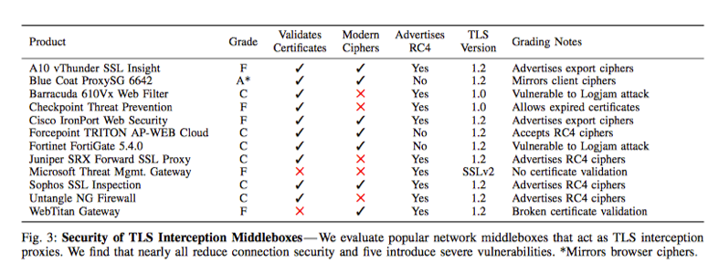

# The Security Impact of HTTPS Interception

**1.**     **论文题目**

**The Security Impact of HTTPS Interception**

作者：Zakir Durumeric , Elie Bursztein ,Zane Ma , Drew Springall 

 

**2.**     **文章概述**

随着HTTPS部署的增长，中间件、反病毒产品越来越多地拦截TLS链接以保留对网络流量的可见性。在这篇文章中，作者对HTTPS拦截的普遍性和影响进行了全面的研究。研究发现以下几点：Web服务器可以通过识别HTTP User-Agent头和TLS客户端行为之间的不匹配来检测拦截；在现实生活中，这种HTTPS拦截数量远超预期，它的数量比先前估计的多一个数量级，并对连接安全性产生了巨大影响。

**3.**     **主要内容**

研究者分别从三大渠道测量HTTPS拦截的情况，分辨用户是否使用了HTTPS检测工具。

A:Firefox 更新服务器

Firefox浏览器经常通过HTTPS从中央Mozilla服务器检索XML文档来检查软件更新。研究者发现相比其他浏览器，Firefox流量被拦截的比例更低，原因在于Firefox有自带的证书存储，而其余浏览器使用的都是系统默认的证书存储空间。因此，有些杀毒软件就不会拦截Firefox的流量。在企业环境中，尽管可以额外在Firefox的证书管理中添加证书，但这还是会增加麻烦，因此很多IT管理者就索性不再拦截Firefox流量。

B: 电商网站

研究人员在电商网站观察了多个访问信息，并对HTTP User-Agent进行分析，识别出TLS握手时与UA浏览器不符的流量，结果观察到6.8%的流量被拦截，另外0.9%可能被拦截。与此同时，拦截最多流量的三款杀毒软件分别是Avast、Blue Cat、AVG，分别拦截了10.8%、9.1%、7.6%的流量。

C: CDN流量

通过检测Cloudflare拦截的流量，研究人员观察到10.9%的拦截率，握手环节中比例最高的指纹来自杀毒软件Avast, AVG, Kaspersky和BitDefender。

 研究者还对这些拦截情况分别进行了安全性评估（主要侧重于TLS握手的安全性）

打分情况如下：

                       

**4.**     **心得体会**

这篇文章是对现实生活中HTTPS拦截的安全影响的第一次全面研究，研究者们描述了由现代浏览器、普通安全产品和恶意软件产生的TLS握手情况。研究者在三个不同的网络上部署了监测机制用以监测拦截情况。研究揭示了当下这种拦截模式下，对HTTPS原生的安全性产生了割裂，降低了安全性，且37%存在严重漏洞。这种现状揭示了当下网络中普遍存在的现象，往往某个安全协议在单独设计时几乎不会存在任何问题，但在部署过程中往往差强人意，或因为部署不当，或因为与其他协议的冲突，会导致该安全协议的安全性大大降低，甚至爆出严重漏洞。这在以后的研究过程中，不妨作为一个可以思考与关注的点。此外，该篇文章进行监控的位置很值得玩味，研究者分别从CDN节点、电商网站、Firefox服务进行部署。这几个节点来测量数据往往事半功倍，工作量少，但能较好地观察网络现状，而且这几个节点也往往是拦截多发区域，对测量HTTPS的拦截情况很有帮助。